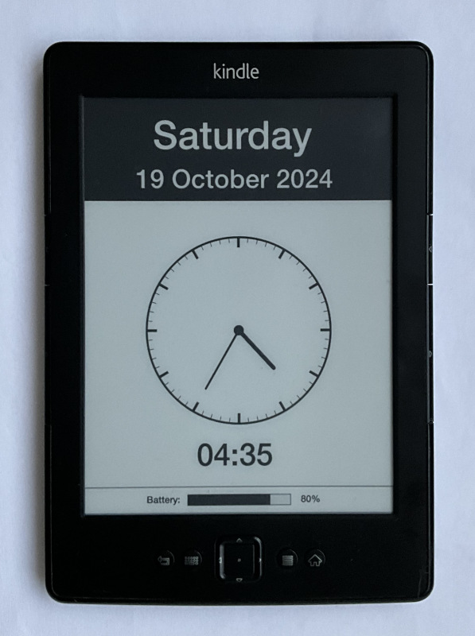

# Kindle Clock

Transforms your idle old Kindle device into a stylish clock display.

## Prerequisites
Jailbroken Kindle device with [KUAL](https://www.mobileread.com/forums/showthread.php?t=203326) installed.

## Installation
* Connect your Kindle device to your computer via USB.
* Copy the `kclock` directory to the `extensions` directory on your Kindle device.
* Safely eject your Kindle device from your computer.
* On your Kindle device, open KUAL and navigate to the "Kindle Clock" application.
* Launch the application to start the clock display.

## Usage
* The clock will automatically update every minute to display the current time, date, weekday, and battery level.
* To exit the clock and return to the Kindle home screen, press the "Home" button on your Kindle device.